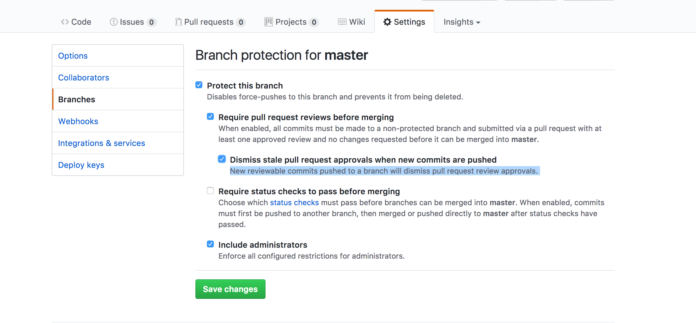
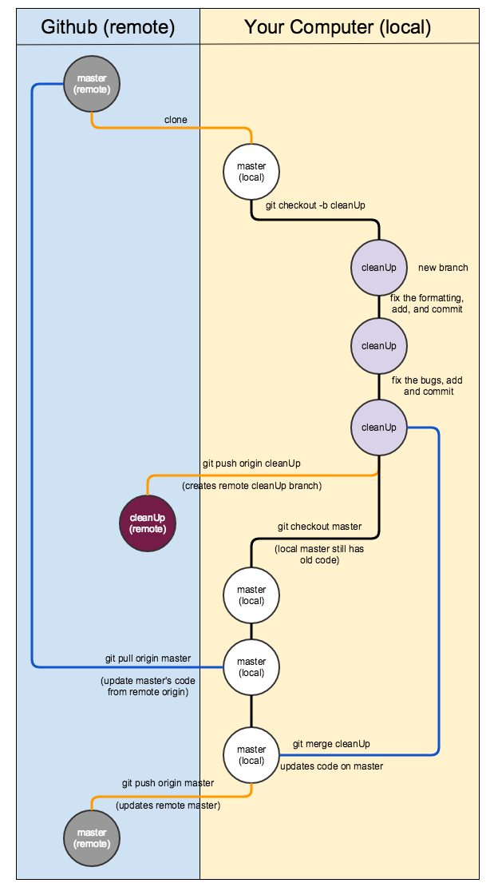

# Git 4 Groups

## Github Settings 
Under settings and branching select the following settings to lock down master branch from merging.

## Git Work Flow
Local and using PRs on GitHub

[https://github.com/mhwalsh/lecture-guides/blob/master/git-group-workflow.md](https://github.com/mhwalsh/lecture-guides/blob/master/git-group-workflow.md)

The above diagram show merging into master than pushing to the remote. The preferred way to resolve conflicts in merge master into your feature branch, resolve conflicts, then push the feature branch again, and merge down to master on the github ui.
